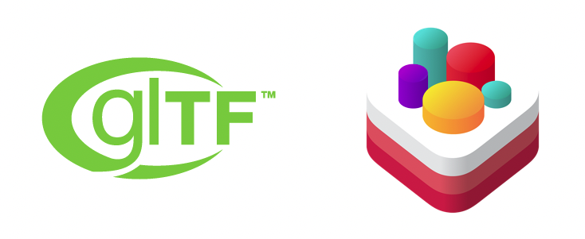

# gltf-mac

[](https://travis-ci.org/61315/GLTFMac)
[](https://cocoapods.org/pods/GLTFMac)
[](https://cocoapods.org/pods/GLTFMac)
[](https://cocoapods.org/pods/GLTFMac)

A library for loading glTF 2.0 assets into iOS runtime.



**gltf-mac** is actively underdevelopment thus being not production-ready.

## Example

To run the example project, clone the repo, and run `pod install` from the Example directory first.

## Requirements

- iOS 12.0 and above

## Installation

gltf-mac is available through [CocoaPods](https://cocoapods.org). To install
it, simply add the following line to your Podfile:

```ruby
pod 'GLTFMac'
```

## Extras

### TODO

- [ ] Add draco support
- [ ] Write glTF 2.0 spec conformance table
- [ ] Write unit test for standard glTF 2.0 assets
- [ ] Load third-party libraries from git submodule
- [ ] Rewrite tinygltf wrapper for SceneKit
- [ ] Write benchmarks for alternative glTF loaders
- [ ] Add support for Model I/O

### Contender for glTF loader

Here's some of the greatest libraries for loading/saving glTF assets written in C/C++.

- [jkuhlmann/cgltf](https://github.com/)
- [syoyo/tinygltf](https://github.com/)
- [jessey-git/fx-gltf](https://github.com/)
- [Microsoft/glTF-SDK](https://github.com/)

### Alternative libraries

There are some other cool run-out-of-box libraries that you should definitely check out.

- [warrenm/GLTFKit](https://github.com/warrenm/GLTFKit)
- [warrenm/GLTFKit2](https://github.com/warrenm/GLTFKit2)
- [magicien/GLTFSceneKit](https://github.com/magicien/GLTFSceneKit)
- [SVRF/SvrfGLTFSceneKit](https://github.com/SVRF/SvrfGLTFSceneKit)
- [3D4Medical/glTFSceneKit](https://github.com/3D4Medical/glTFSceneKit)

## Third Party Licenses

- Battle Damaged Sci-fi Helmet - PBR by [theblueturtle_](https://sketchfab.com/theblueturtle_), CC BY-NC
- [entrance_hall_1k_blurred.png](https://hdrihaven.com/hdri/?h=entrance_hall) by Sergej Majboroda, CC0 Public Domain 

- [syoyo/tinygltf](https://github.com/syoyo/tinygltf) MIT License
- [nothings/stb  stb_image.h](https://github.com/nothings/stb) Public Domain
- [nlohmann/json](https://github.com/nlohmann/json)  MIT License
- [warrenm/GLTFKit](https://github.com/warrenm/GLTFKit) ISC License
- [toshiks/glTF-quicklook](https://github.com/toshiks/glTF-quicklook) MIT License

See the [NOTICES](GLTFMac/NOTICES) file for more info.

## Author

Minseo Park, studio61315@gmail.com

## License

**gltf-mac** is available under the MIT license. See the [LICENSE](LICENSE) file for more info.
